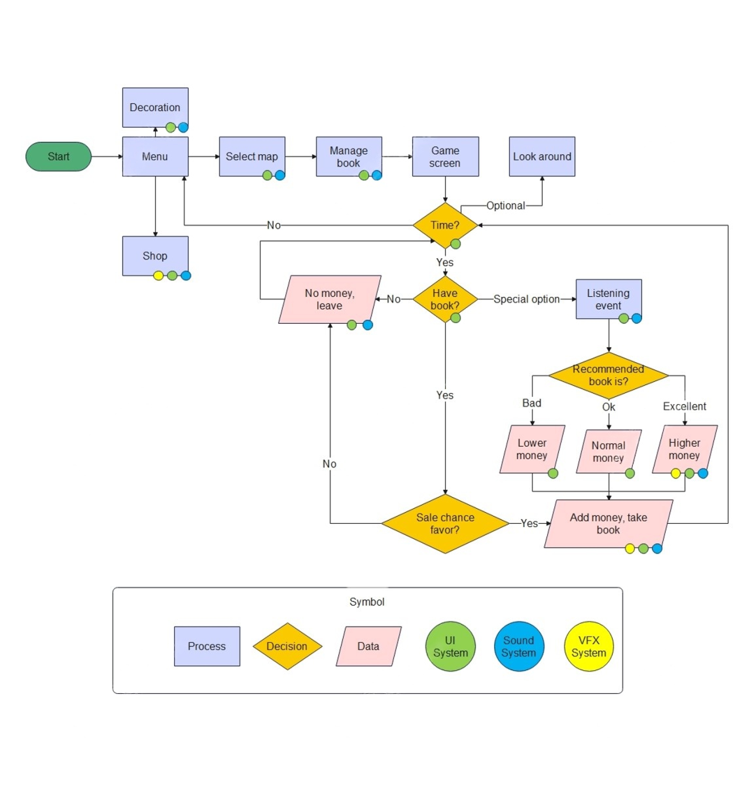

# WORDS-ON-THE-WAVES
WORDS ON THE WAVES where you are a bookseller, your work is to manage book and serve your customer, you can also decorate and collect some rare items on the map for your book cart
## Features
- Life simulation
- Relaxing gameplay
- Colorful graphics
- Training your logical thinking skill
## System Flow Diagram

## Gameplay

